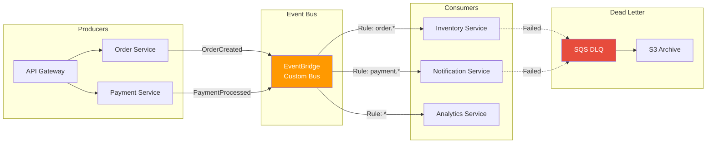
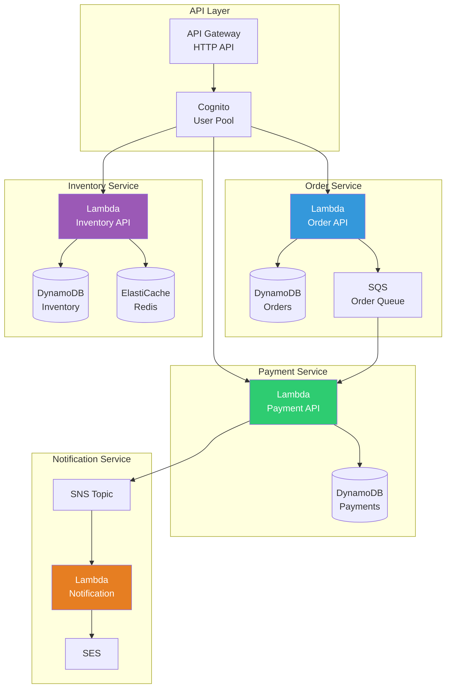
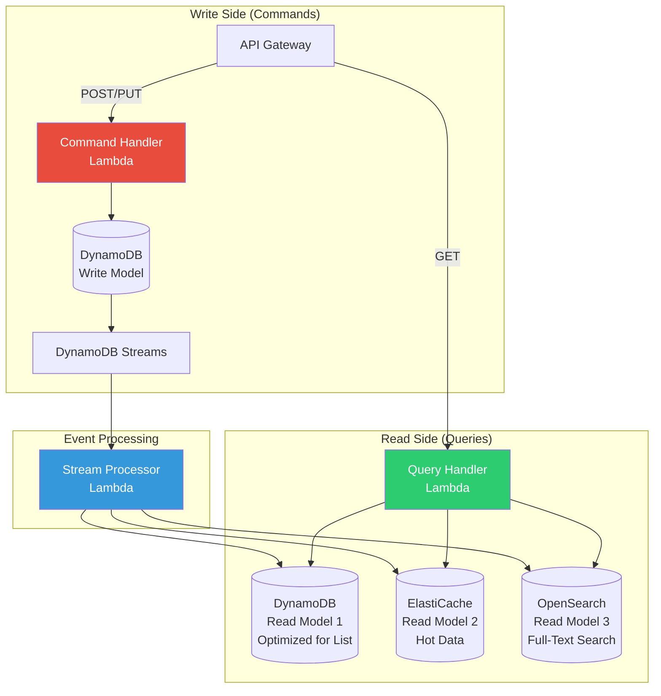
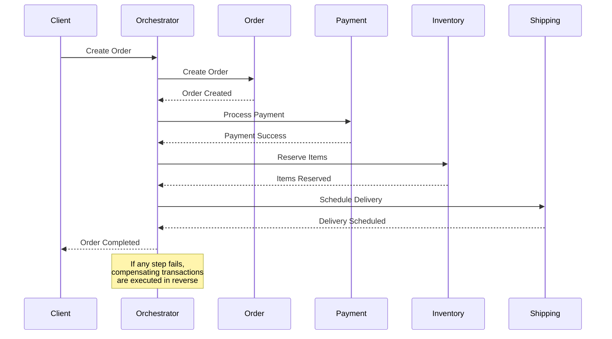
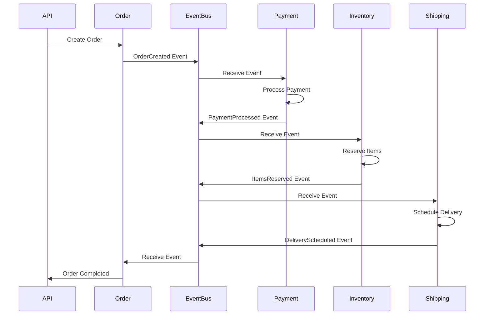
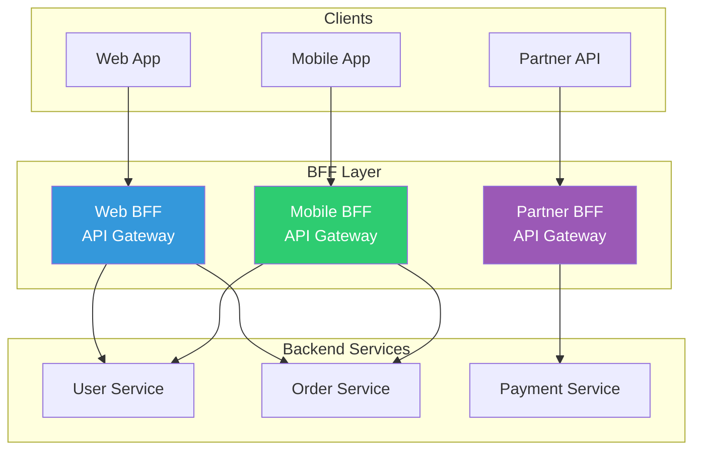
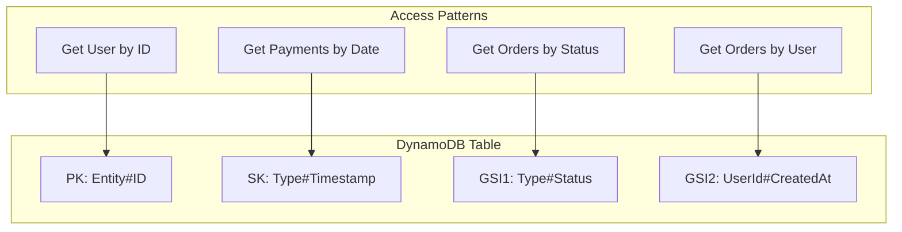
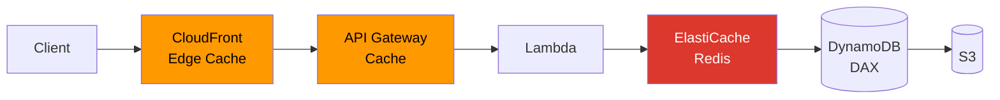
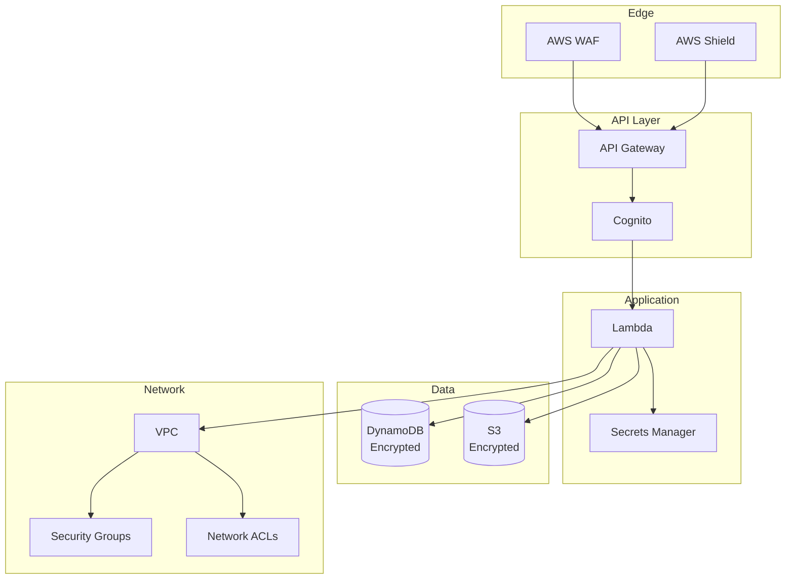

# AWS Architecture Patterns

Comprehensive guide to different architectural patterns implemented with Terraform.

## Table of Contents

- [Event-Driven Architecture](#event-driven-architecture)
- [Microservices Architecture](#microservices-architecture)
- [CQRS Pattern](#cqrs-pattern)
- [Saga Pattern](#saga-pattern)
- [API Gateway Patterns](#api-gateway-patterns)
- [Data Patterns](#data-patterns)

---

## Event-Driven Architecture

### Overview

Event-driven architecture using Amazon EventBridge, SNS, and SQS for asynchronous communication between services.

### Architecture Diagram



### Key Components

#### 1. EventBridge Custom Bus
```hcl
resource "aws_cloudwatch_event_bus" "main" {
  name = "${var.project_name}-event-bus"
  
  tags = {
    Environment = var.environment
    Pattern     = "event-driven"
  }
}
```

#### 2. Event Rules
```hcl
resource "aws_cloudwatch_event_rule" "order_events" {
  name           = "order-events-rule"
  event_bus_name = aws_cloudwatch_event_bus.main.name
  
  event_pattern = jsonencode({
    source      = ["order.service"]
    detail-type = ["OrderCreated", "OrderUpdated"]
  })
}
```

#### 3. Event Targets
```hcl
resource "aws_cloudwatch_event_target" "inventory_lambda" {
  rule           = aws_cloudwatch_event_rule.order_events.name
  event_bus_name = aws_cloudwatch_event_bus.main.name
  arn            = aws_lambda_function.inventory_service.arn
  
  dead_letter_config {
    arn = aws_sqs_queue.dlq.arn
  }
  
  retry_policy {
    maximum_event_age       = 3600
    maximum_retry_attempts  = 3
  }
}
```

### Benefits

- ✅ **Loose Coupling**: Services don't know about each other
- ✅ **Scalability**: Each consumer scales independently
- ✅ **Resilience**: Built-in retry and DLQ
- ✅ **Extensibility**: Easy to add new consumers

### Use Cases

- E-commerce order processing
- Real-time data pipeline
- Microservices communication
- IoT data ingestion

---

## Microservices Architecture

### Overview

Independent, deployable services with their own data stores and APIs.

### Architecture Diagram



### Service Template

#### Directory Structure
```
microservices/
├── order-service/
│   ├── terraform/
│   │   ├── main.tf
│   │   ├── lambda.tf
│   │   ├── dynamodb.tf
│   │   └── api.tf
│   └── src/
│       ├── handlers/
│       ├── models/
│       └── utils/
├── payment-service/
├── inventory-service/
└── shared/
    ├── modules/
    │   ├── lambda/
    │   ├── api/
    │   └── database/
    └── policies/
```

#### Service Module
```hcl
module "order_service" {
  source = "./modules/microservice"
  
  service_name = "order"
  environment  = var.environment
  
  # Lambda configuration
  lambda_config = {
    runtime     = "nodejs18.x"
    memory_size = 512
    timeout     = 30
  }
  
  # Database configuration
  database_config = {
    billing_mode = "PAY_PER_REQUEST"
    hash_key     = "orderId"
    range_key    = "createdAt"
  }
  
  # API Gateway routes
  api_routes = [
    {
      path   = "/orders"
      method = "POST"
    },
    {
      path   = "/orders/{id}"
      method = "GET"
    }
  ]
  
  # Environment variables
  environment_variables = {
    PAYMENT_QUEUE_URL = module.payment_service.queue_url
    TABLE_NAME        = module.order_service.table_name
  }
}
```

### Communication Patterns

#### Synchronous (HTTP)
```typescript
// Order Service → Payment Service
const response = await fetch(
  `${process.env.PAYMENT_API_URL}/validate`,
  {
    method: 'POST',
    headers: { 'Authorization': `Bearer ${token}` },
    body: JSON.stringify({ amount, currency })
  }
);
```

#### Asynchronous (SQS)
```typescript
// Order Service → Payment Service
await sqs.sendMessage({
  QueueUrl: process.env.PAYMENT_QUEUE_URL,
  MessageBody: JSON.stringify({
    orderId: order.id,
    amount: order.total,
    timestamp: Date.now()
  })
}).promise();
```

### Benefits

- ✅ **Independent Deployment**: Each service deploys separately
- ✅ **Technology Diversity**: Different runtimes per service
- ✅ **Team Autonomy**: Teams own entire service lifecycle
- ✅ **Fault Isolation**: Service failures don't cascade

---

## CQRS Pattern

### Overview

Command Query Responsibility Segregation - separate read and write models for optimal performance.

### Architecture Diagram



### Implementation

#### Write Model (Commands)
```hcl
resource "aws_dynamodb_table" "write_model" {
  name           = "${var.project_name}-write-model"
  billing_mode   = "PAY_PER_REQUEST"
  hash_key       = "id"
  range_key      = "version"
  
  attribute {
    name = "id"
    type = "S"
  }
  
  attribute {
    name = "version"
    type = "N"
  }
  
  stream_enabled   = true
  stream_view_type = "NEW_AND_OLD_IMAGES"
  
  point_in_time_recovery {
    enabled = true
  }
}
```

#### Read Model Projections
```hcl
# Read Model 1: List View
resource "aws_dynamodb_table" "read_model_list" {
  name         = "${var.project_name}-read-list"
  billing_mode = "PAY_PER_REQUEST"
  hash_key     = "userId"
  range_key    = "createdAt"
  
  global_secondary_index {
    name            = "StatusIndex"
    hash_key        = "status"
    range_key       = "createdAt"
    projection_type = "ALL"
  }
}

# Read Model 2: Cache
resource "aws_elasticache_cluster" "read_cache" {
  cluster_id           = "${var.project_name}-read-cache"
  engine               = "redis"
  node_type            = "cache.t3.micro"
  num_cache_nodes      = 1
  parameter_group_name = "default.redis7"
}
```

#### Stream Processor
```typescript
export const handler: DynamoDBStreamHandler = async (event) => {
  for (const record of event.Records) {
    if (record.eventName === 'INSERT' || record.eventName === 'MODIFY') {
      const newImage = record.dynamodb?.NewImage;
      
      // Project to read model 1
      await projectToListView(newImage);
      
      // Project to cache
      await projectToCache(newImage);
      
      // Project to search
      await projectToSearch(newImage);
    }
  }
};
```

### Benefits

- ✅ **Performance**: Optimized read models
- ✅ **Scalability**: Read/write scale independently
- ✅ **Flexibility**: Multiple read models for different use cases
- ✅ **Eventually Consistent**: Acceptable for most scenarios

---

## Saga Pattern

### Overview

Distributed transaction management using orchestration or choreography.

### Orchestration Pattern



### Choreography Pattern



### Implementation

#### Saga State Machine (Step Functions)
```hcl
resource "aws_sfn_state_machine" "order_saga" {
  name     = "${var.project_name}-order-saga"
  role_arn = aws_iam_role.step_functions.arn
  
  definition = jsonencode({
    Comment = "Order Processing Saga"
    StartAt = "CreateOrder"
    States = {
      CreateOrder = {
        Type     = "Task"
        Resource = aws_lambda_function.create_order.arn
        Catch = [{
          ErrorEquals = ["States.ALL"]
          Next        = "HandleFailure"
        }]
        Next = "ProcessPayment"
      }
      ProcessPayment = {
        Type     = "Task"
        Resource = aws_lambda_function.process_payment.arn
        Catch = [{
          ErrorEquals = ["States.ALL"]
          Next        = "CompensateOrder"
        }]
        Next = "ReserveInventory"
      }
      ReserveInventory = {
        Type     = "Task"
        Resource = aws_lambda_function.reserve_inventory.arn
        Catch = [{
          ErrorEquals = ["States.ALL"]
          Next        = "CompensatePayment"
        }]
        Next = "ScheduleShipping"
      }
      ScheduleShipping = {
        Type     = "Task"
        Resource = aws_lambda_function.schedule_shipping.arn
        Catch = [{
          ErrorEquals = ["States.ALL"]
          Next        = "CompensateInventory"
        }]
        Next = "Success"
      }
      Success = {
        Type = "Succeed"
      }
      CompensateInventory = {
        Type     = "Task"
        Resource = aws_lambda_function.compensate_inventory.arn
        Next     = "CompensatePayment"
      }
      CompensatePayment = {
        Type     = "Task"
        Resource = aws_lambda_function.compensate_payment.arn
        Next     = "CompensateOrder"
      }
      CompensateOrder = {
        Type     = "Task"
        Resource = aws_lambda_function.compensate_order.arn
        Next     = "HandleFailure"
      }
      HandleFailure = {
        Type = "Fail"
      }
    }
  })
}
```

### Benefits

- ✅ **Consistency**: Distributed transactions with compensations
- ✅ **Visibility**: Clear workflow visualization
- ✅ **Reliability**: Automatic retries and error handling
- ✅ **Auditability**: Complete execution history

---

## API Gateway Patterns

### Pattern Comparison

| Pattern | Use Case | Components |
|---------|----------|------------|
| **BFF** | Mobile + Web apps with different needs | Multiple API Gateways |
| **API Aggregation** | Combining multiple backend calls | Lambda aggregator |
| **Rate Limiting** | Protect backend from abuse | Usage plans + API keys |
| **Request Validation** | Input validation | API Gateway models |
| **Caching** | Reduce backend load | API Gateway cache |

### Backend for Frontend (BFF)



### API Aggregation

```typescript
// Lambda aggregator
export const handler = async (event: APIGatewayProxyEvent) => {
  const userId = event.requestContext.authorizer?.userId;
  
  // Parallel calls to multiple services
  const [user, orders, payments] = await Promise.all([
    fetchUser(userId),
    fetchOrders(userId),
    fetchPayments(userId)
  ]);
  
  // Aggregate response
  return {
    statusCode: 200,
    body: JSON.stringify({
      user: user,
      recentOrders: orders.slice(0, 5),
      paymentMethods: payments
    })
  };
};
```

---

## Data Patterns

### Single Table Design



### Example Terraform

```hcl
resource "aws_dynamodb_table" "single_table" {
  name         = "${var.project_name}-data"
  billing_mode = "PAY_PER_REQUEST"
  hash_key     = "PK"
  range_key    = "SK"
  
  attribute {
    name = "PK"
    type = "S"
  }
  
  attribute {
    name = "SK"
    type = "S"
  }
  
  attribute {
    name = "GSI1PK"
    type = "S"
  }
  
  attribute {
    name = "GSI1SK"
    type = "S"
  }
  
  global_secondary_index {
    name            = "GSI1"
    hash_key        = "GSI1PK"
    range_key       = "GSI1SK"
    projection_type = "ALL"
  }
  
  ttl {
    attribute_name = "expiresAt"
    enabled        = true
  }
}
```

### Data Structure Example

```json
// User Entity
{
  "PK": "USER#123",
  "SK": "METADATA",
  "type": "User",
  "email": "user@example.com",
  "name": "John Doe",
  "GSI1PK": "USER",
  "GSI1SK": "2026-02-26T20:00:00Z"
}

// Order Entity
{
  "PK": "USER#123",
  "SK": "ORDER#2026-02-26#456",
  "type": "Order",
  "orderId": "456",
  "total": 99.99,
  "status": "completed",
  "GSI1PK": "ORDER#completed",
  "GSI1SK": "2026-02-26T20:00:00Z"
}
```

---

## Performance Optimization Patterns

### Caching Strategy



### Lambda Optimization

```hcl
resource "aws_lambda_function" "optimized" {
  function_name = "${var.project_name}-optimized"
  
  # Provisioned concurrency for predictable latency
  reserved_concurrent_executions = 10
  
  # Environment variables
  environment {
    variables = {
      # Connection pooling
      DB_POOL_SIZE = "10"
      
      # Cache TTL
      CACHE_TTL = "300"
      
      # Enable X-Ray
      AWS_XRAY_DAEMON_ADDRESS = "xray-daemon:2000"
    }
  }
  
  # VPC configuration for database access
  vpc_config {
    subnet_ids         = var.private_subnet_ids
    security_group_ids = [aws_security_group.lambda.id]
  }
  
  # Layers for shared dependencies
  layers = [
    aws_lambda_layer_version.shared_deps.arn
  ]
}

resource "aws_lambda_provisioned_concurrency_config" "optimized" {
  function_name                     = aws_lambda_function.optimized.function_name
  provisioned_concurrent_executions = 5
  qualifier                         = aws_lambda_alias.live.name
}
```

---

## Monitoring & Observability

### Comprehensive Observability

```mermaid
graph TB
    subgraph "Application"
        Lambda[Lambda Functions]
        API[API Gateway]
        DDB[(DynamoDB)]
    end
    
    subgraph "Metrics"
        CW[CloudWatch<br/>Metrics]
        Dashboard[CloudWatch<br/>Dashboards]
    end
    
    subgraph "Logs"
        Logs[CloudWatch Logs]
        Insights[CloudWatch<br/>Insights]
    end
    
    subgraph "Tracing"
        XRay[X-Ray]
        ServiceMap[Service Map]
    end
    
    subgraph "Alerts"
        Alarms[CloudWatch Alarms]
        SNS[SNS Topics]
        PagerDuty[PagerDuty]
    end
    
    Lambda --> CW
    API --> CW
    DDB --> CW
    
    Lambda --> Logs
    API --> Logs
    
    Lambda --> XRay
    API --> XRay
    
    CW --> Dashboard
    Logs --> Insights
    XRay --> ServiceMap
    
    CW --> Alarms
    Alarms --> SNS
    SNS --> PagerDuty
```

---

## Cost Optimization

### Strategies

1. **Right-sizing**
   - Use Lambda power tuning
   - DynamoDB on-demand vs provisioned
   - ElastiCache node sizing

2. **Reserved Capacity**
   - DynamoDB reserved capacity
   - Savings Plans for Lambda

3. **Data Lifecycle**
   - S3 lifecycle policies
   - DynamoDB TTL
   - CloudWatch Logs retention

4. **Caching**
   - API Gateway caching
   - Lambda@Edge
   - ElastiCache

---

## Security Best Practices

### Defense in Depth



---

## Next Steps

Refer to the `examples/` directory for complete working implementations of each pattern.
