# Architecture Diagrams

Visual representations of AWS architecture patterns using Mermaid.

## High-Level Architecture

### Complete Serverless Stack

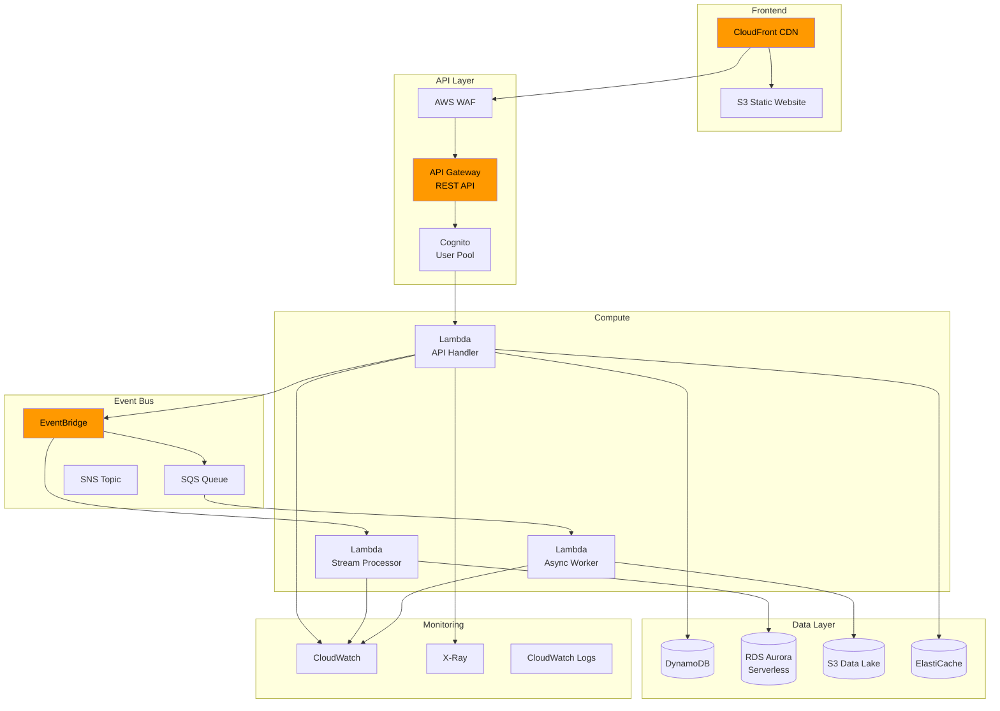

## Data Flow Diagrams

### Request Flow with Caching

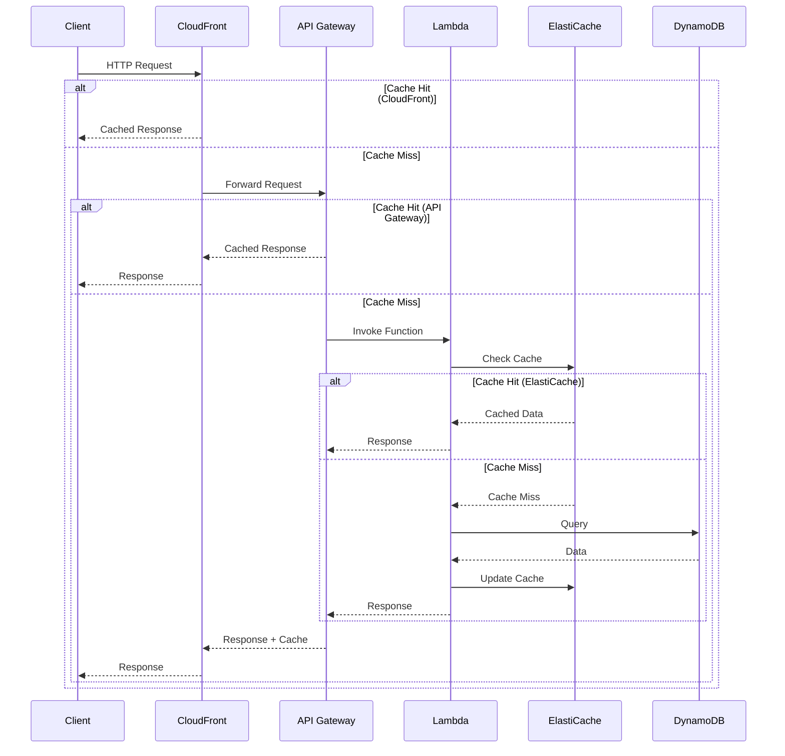

### Event Processing Pipeline

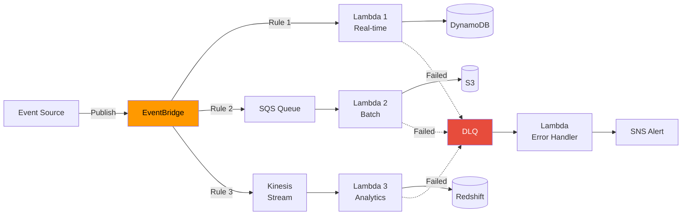

## Infrastructure Diagrams

### Multi-Region Active-Active

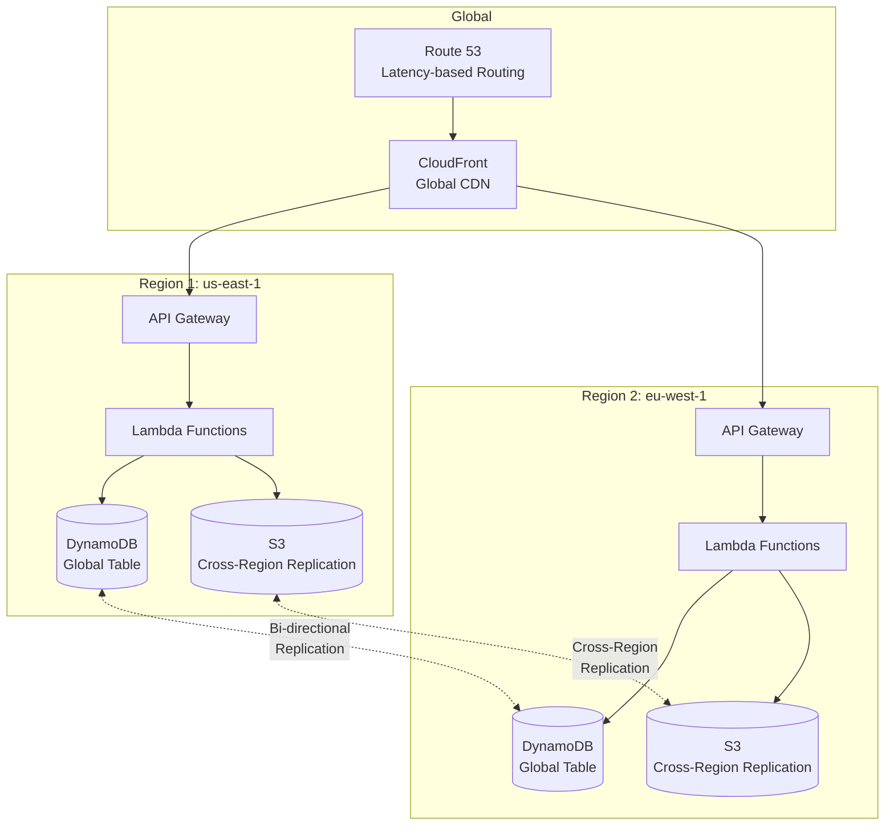

### VPC Architecture

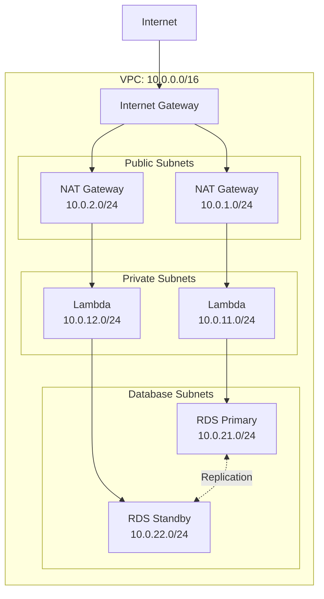

## Deployment Diagrams

### CI/CD Pipeline

```mermaid
graph LR
    subgraph "Source"
        GitHub[GitHub<br/>Repository]
    end
    
    subgraph "CI/CD"
        CodePipeline[CodePipeline]
        CodeBuild[CodeBuild]
    end
    
    subgraph "Testing"
        Unit[Unit Tests]
        Integration[Integration Tests]
        Security[Security Scan]
    end
    
    subgraph "Deploy Dev"
        TFPlan[Terraform Plan]
        TFApply[Terraform Apply]
    end
    
    subgraph "Deploy Prod"
        Approval[Manual Approval]
        ProdDeploy[Production Deploy]
    end
    
    GitHub -->|Webhook| CodePipeline
    CodePipeline --> CodeBuild
    
    CodeBuild --> Unit
    Unit --> Integration
    Integration --> Security
    
    Security -->|Pass| TFPlan
    TFPlan --> TFApply
    
    TFApply --> Approval
    Approval -->|Approved| ProdDeploy
    
    style Security fill:#2ecc71,color:#fff
    style Approval fill:#f39c12,color:#fff
```

### Blue-Green Deployment

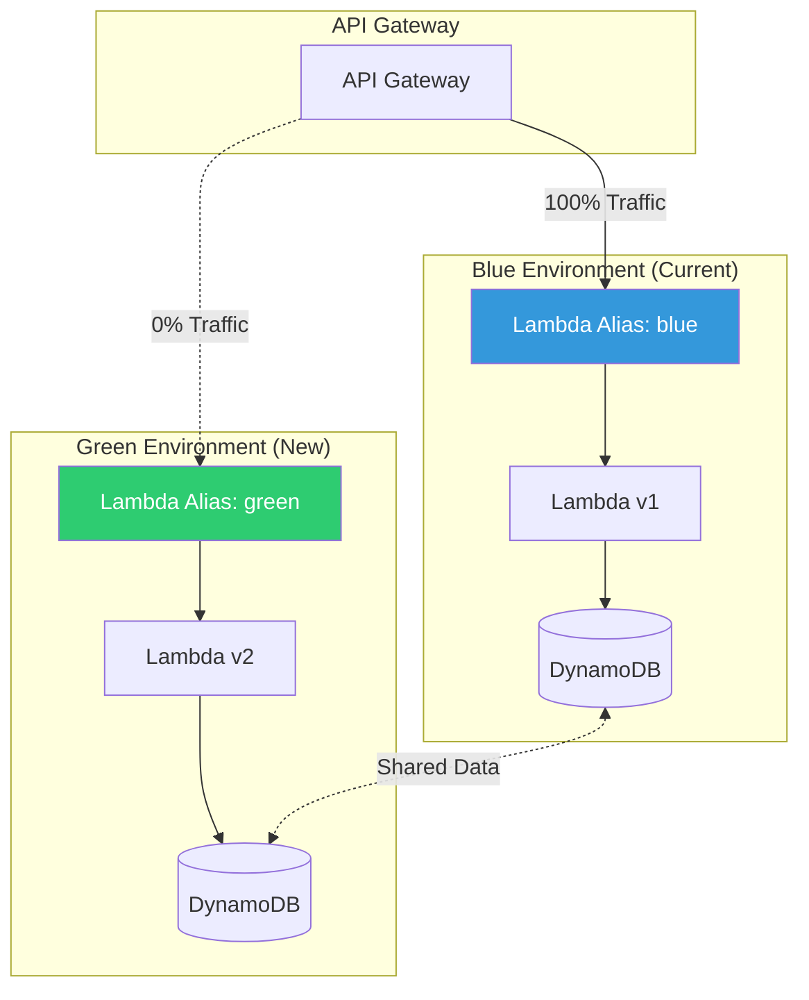

## Security Diagrams

### IAM Roles and Policies

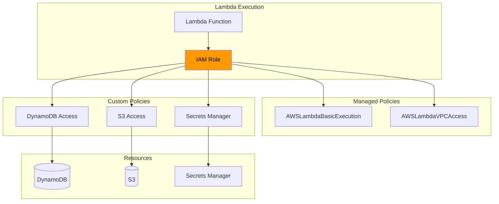

### Network Security

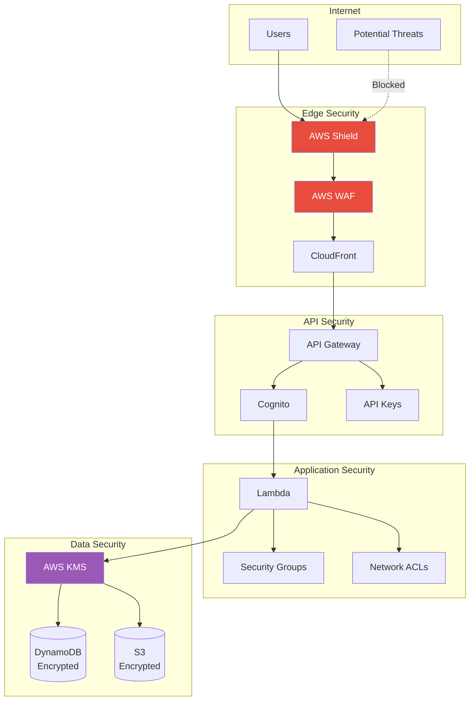

## Monitoring Dashboards

### Observability Stack

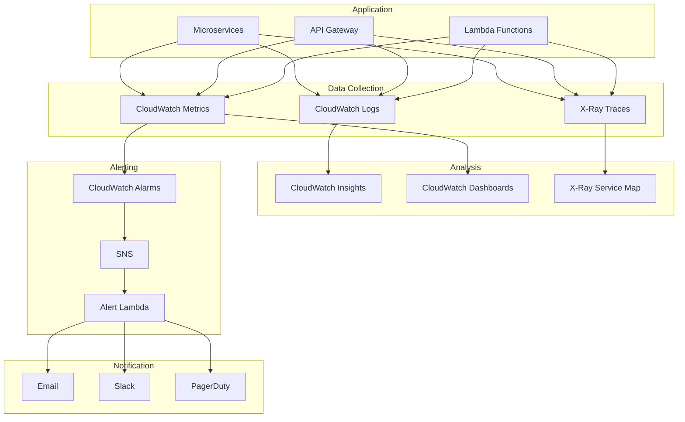

---

## Cost Optimization

### Cost Allocation

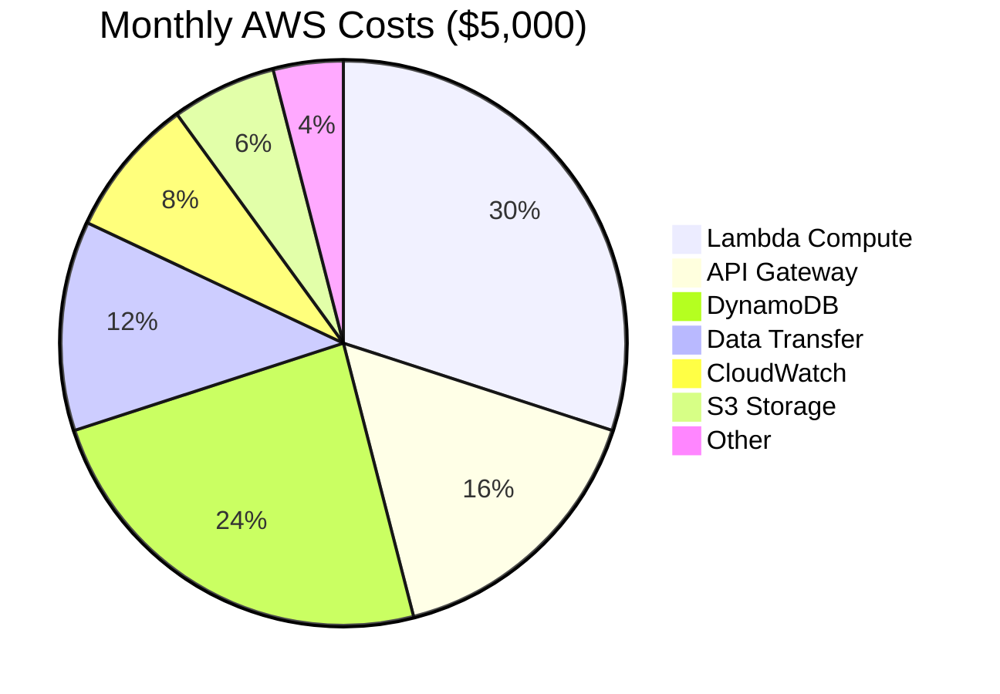

### Savings Opportunities

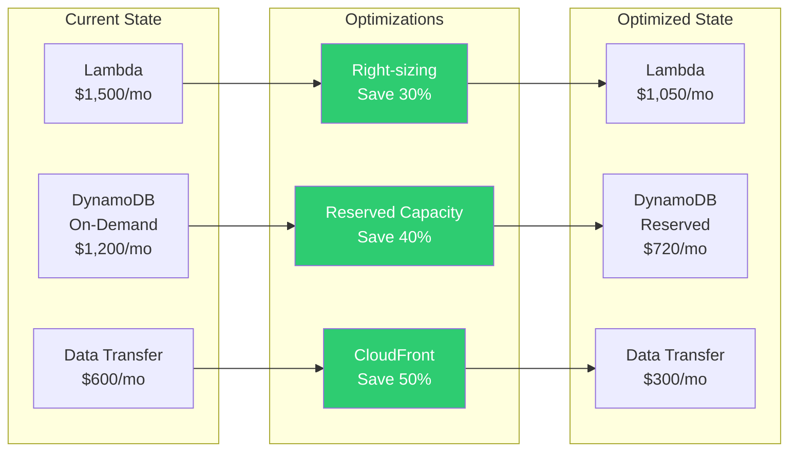

---

For implementation details, refer to the corresponding Terraform modules in the `terraform/modules/` directory.
